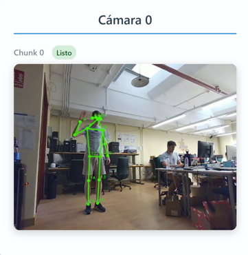
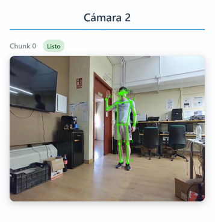
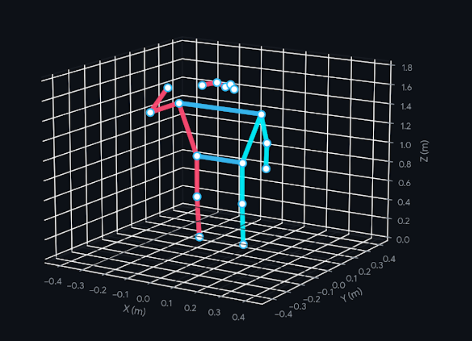

# Multi-Camera Markerless Gait Analysis (backend)

This is the server component of a markerless gait analysis system for knee osteoarthritis, an open source project built at the University of Malaga with Costa del Sol Hospital during a research laboratory placement. It receives the video recorded by three cameras, detects 2D keypoints with several pose models, then combines them into a skeleton using ensembling, and finally reconstructs it in 3D and computes the angles and measurements used for the analysis.

<p align="center">
  
  
  
</p>
<p align="center">
  
</p>
<p align="center"><em>The three camera views with the 2D detections drawn on them, and the 3D skeleton reconstructed from that frame.</em></p>

The person in these images is the author, recorded during development. Sessions with real patients are recorded and kept by the hospital under the GDPR and the Spanish LOPDGDD, and no patient data is committed to this repository.

The relative pose of the cameras is estimated for every session from the patient's keypoints, leading to a reprojection error of 0.83 px after bundle adjustment. The clinical validation campaign has not been run yet.

I developed this project from the beginning, and it involves the GPU coordinator, the ensemble and the reconstruction and analysis code. The pose models are pretrained OpenMMLab checkpoints, and the acquisition client is in the `markerless-gait-analysis-frontend` repository.

## Pipeline

Chunks are processed as they arrive, and the 3D stage starts on its own once the session is complete:

1. Run the three MMPose detectors on the incoming chunk.
2. Save coordinates and confidences of every frame, separately for each detector.
3. Fuse the detectors per keypoint, once all cameras have finished the final chunk.
4. Estimate the extrinsic parameters of the cameras from the fused keypoints.
5. Triangulate each keypoint and refine points and cameras with bundle adjustment.
6. Scale to metric units and compute angles, body measurements and reprojection error.

## 2D detection and ensembling

Each chunk is run through ViTPose-large on COCO (17 keypoints), and HRNet-w48 and CSPNeXt-m on COCO-WholeBody (133 keypoints). The results of every frame are written as two `.npy` arrays, coordinates and confidences, under `detector/camera/chunk`, so the predictions of two models on the same joint can be compared later without running inference again. A semaphore limits how many chunks are on the GPU at the same time, using the number of devices listed in `available_gpus`.

The fusion is done per keypoint and not per frame. Every detector carries a weight vector as long as its own keypoint list: ViTPose weighs 3.0 on the 17 body joints, while HRNet and CSPNeXt weigh 1.0 on those same joints and on the 6 foot points, and 0.0 on the 110 face and hand points. Those zeros are what turns two 133-point models and one 17-point model into a single 23-point skeleton, and the feet are the reason for including the WholeBody models, because COCO has no heel or toe. Each fused coordinate is the mean of the available predictions, weighted by the detector weight times the confidence that the model itself reported for that point, so a detector that is unsure about one occluded ankle loses influence on that ankle and keeps it on the rest.

The overlays in the images above are the annotated videos that `save_annotated_videos` writes, which draw the output of a single detector. The fused keypoints are stored as arrays and are not drawn.

## 3D reconstruction

The reconstruction is geometric and there is no learned 3D lifting anywhere in it. The only inputs are the fused 2D keypoints and the intrinsic parameters of the cameras.

### Camera extrinsics

The intrinsic parameters are taken from the Orbbec Gemini 335Le specification. The extrinsics cannot be, so they are estimated for each session from the fused 2D points: fundamental matrix with the eight-point algorithm inside RANSAC (1000 iterations, 3 px epipolar threshold), essential matrix from the two intrinsic matrices, and four candidate poses from its SVD, of which the chosen one is the pose that leaves the most triangulated points in front of both cameras. `camera0` is the reference and keeps the identity pose.

Doing this on a single frame turned out not to be enough, because the estimated pose came out noticeably different from one chunk to the next. The extrinsics are now computed on frame 15 of every chunk of the session and averaged, the translations with the arithmetic mean and the rotations through the SVD of the mean matrix, which returns a proper rotation instead of a matrix that is only close to one. The cameras do not move while the patient walks, so this averaged set is computed once and reused for every frame.

### Triangulation, bundle adjustment and scale

Each of the 23 keypoints is triangulated by DLT, stacking the two constraint rows of every camera that saw the point above confidence 0.5 and taking the last right singular vector, with two views as the minimum. Bundle adjustment then refines the 3D points together with the extrinsics of the two non-reference cameras, using Levenberg-Marquardt over 3 parameters per point plus 6 per free camera in Rodrigues form, against the fused observations.

The reconstruction is metric up to a scale factor, which is fixed with one anatomical constraint: the nose to ankle distance is set to the height of the patient minus 15 cm. Chunks are reconstructed in parallel, one process per chunk.

## Data and outputs

The 3D skeletons are saved in `data/processed/3D_keypoints/patient{id}/session{id}/{frame}_{chunk}.npy`, with the same naming as the 2D arrays they come from. Nothing upstream is deleted: the per-detector predictions, the fused 2D keypoints and the 3D points all stay on disk, organized by patient, session, camera, detector, chunk and frame.

Reprojection error is computed per camera and per reconstruction stage, so the triangulated skeleton and the one refined by bundle adjustment can be compared against the same observations. On top of the 3D points the analysis produces the knee flexion angles from the hip-knee-ankle vectors with their left-right difference, and around twenty body distances, each one compared against a plausible human range. This last check works as a cheap screen on the geometry, since a session that reports a shoulder width of 90 cm has a reconstruction problem and not an unusual patient.

## Running the server

Place the MMPose checkpoints listed in `config/settings.py` into `mmpose_models/checkpoints/`, then:

```bash
pip install -r requirements.txt
python main.py
```

Torch 2.1.0 with CUDA 12.1, mmcv 2.1.0 and mmdet 3.3.0 are pinned, but MMPose 1.3.2 is an editable install from source and `requirements.txt` does not bring it in. The server listens on port 5000 and the acquisition client has to point at that same port. In `config/settings.py`, `available_gpus` selects the devices and `save_annotated_videos = True` writes videos with the skeleton drawn on them, which is better done on a single GPU.

A session that was already recorded can be reconstructed without the server, editing the patient, session and chunk at the bottom of the file:

```bash
python backend/processing/reconstruction/perform_reconstruction.py
```

`docs/main_classes.md` describes the main classes and their methods.

## API

| Method | Endpoint | Effect |
| --- | --- | --- |
| `POST` | `/api/session/start` | Open a session and create its camera directories. |
| `POST` | `/api/chunks/receive` | Store a chunk and run every detector on it. |
| `POST` | `/api/session/end` | Close the recording and fix the final chunk number. |
| `POST` | `/api/session/cancel` | Drop the session and delete its data. |
| `GET` | `/api/session/status` | Current session, if there is one. |
| `GET` | `/api/gpu/status` | Which of the configured GPUs are busy. |
| `GET` | `/health` | Liveness. |

`/api/session/start` takes `patient_id`, `session_id` and `cameras_count` as JSON, and `/api/chunks/receive` takes the video as a multipart `file` with `camera_id` and `chunk_number` as form fields, limited to 100 MB per chunk. Only one session can be recording, while chunks of previous sessions keep being processed.

## Detectors

| Detector | Config | Keypoints | Ensemble weight |
| --- | --- | --- | --- |
| ViTPose-large | COCO 256x192 | 17 | 3.0 on all 17 |
| HRNet-w48 (DARK) | COCO-WholeBody 384x288 | 133 | 1.0 on body and feet, 0.0 on face and hands |
| CSPNeXt-m (UDP) | COCO-WholeBody 256x192 | 133 | 1.0 on body and feet, 0.0 on face and hands |
| MSPN-4x50 | COCO 256x192 | 17 | no weight vector, disabled in the coordinator |

A new detector is a subclass of `backend/processing/detectors/base.py` with its keypoint names and its weight vector. The names have to agree between models and arrive in the same order, which is true for COCO and for COCO-WholeBody, but it is an assumption that the ensemble does not verify.

## Limitations

- The intrinsics in `config/camera_intrinsics.py` come from the manufacturer specification and not from a calibration with a pattern. The 0.83 px is therefore consistency between views, not accuracy against a measured ground truth.
- The reconstruction module assumes exactly three cameras, named `camera0` to `camera2`.
- The height of the patient is fixed at 190 cm in `ensemble_processor.py`. The metric scale is wrong for anyone else, and it also needs the nose and at least one ankle to be visible.
- Only one person per frame: from each frame only the first detection is kept.
- `backend/tests/` contains prototypes for developing single components, not an automated test suite.
- The outputs support clinical evaluation and are not a diagnosis by themselves.

## License

Apache 2.0, see `LICENSE.md`, which also includes the MMPose citation. The pretrained checkpoints keep the terms of their original authors.
